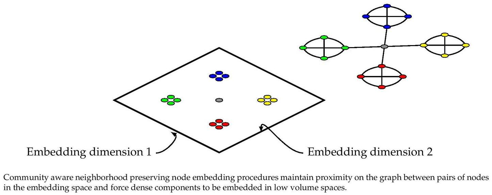

M-NMF 
===============
 [](https://codebeat.co/projects/github-com-benedekrozemberczki-m-nmf-master)

### Abstract
<p align="justify">
Network embedding, aiming to learn the low-dimensional representations of nodes in networks, is of paramount importance in many real applications. One basic requirement of network embedding is to preserve the structure and inherent properties of the networks. While previous network embedding methods primarily preserve the microscopic structure, such as the first- and second-order proximities of nodes, the mesoscopic community structure, which is one of the most prominent feature of networks, is largely ignored. In this paper, we propose a novel Modularized Nonnegative Matrix Factorization (M-NMF) model to incorporate the community structure into network embedding. We exploit the consensus relationship between the representations of nodes and community structure, and then jointly optimize NMF based representation learning model and modularity based community detection model in a unified framework, which enables the learned representations of nodes to preserve both of the microscopic and community structures. We also provide efficient updating rules to infer the parameters of our model, together with the correctness and convergence guarantees. Extensive experimental results on a variety of real-world networks show the superior performance of the proposed method over the state-of-the-arts.
</p>
<p align="center">
  
</p>

The model is now also available in the package [Karate Club](https://github.com/benedekrozemberczki/karateclub).

This repository provides an implementation for M-NMF as it is described in:
> Community Preserving Network Embedding.
> Xiao Wang, Peng Cui, Jing Wang, Jain Pei, WenWu Zhu, Shiqiang Yang.
> Proceedings of the Thirsty-First AAAI conference on Artificial Intelligence (AAAI-17).

A reference MatLab implementation is available [[here]](https://github.com/AnryYang/M-NMF).

### Requirements

The codebase is implemented in Python 3.5.2. Package versions used for development are just below.
```
networkx          2.4
tqdm              4.19.5
numpy             1.13.3
pandas            0.20.3
tensorflow-gpu    1.12.0
jsonschema        2.6.0
texttable         1.2.1
python-louvain    0.11
```

### Datasets
<p align="justify">
The code takes an input graph in a csv file. Every row indicates an edge between two nodes separated by a comma. The first row is a header. Nodes should be indexed starting with 0. A sample graph for the `Facebook Politicians` dataset is included in the  `data/` directory.
</p>
### Logging
<p align="justify">
The models are defined in a way that parameter settings and cluster quality is logged in every single epoch. Specifically we log the followings:
</p>
```
1. Hyperparameter settings.     We save each hyperparameter used in the experiment.
2. Cluster quality.             Measured by modularity. We calculate it in every epoch.
3. Runtime.                     We measure the time needed for optimization -- measured by seconds.
```

### Options

Learning of the embedding is handled by the `src/main.py` script which provides the following command line arguments.

#### Input and output options

```
  --input                STR         Input graph path.                                 Default is `data/food_edges.csv`.
  --embedding-output     STR         Embeddings path.                                  Default is `output/embeddings/food_embedding.csv`.
  --cluster-mean-output  STR         Cluster centers path.                             Default is `output/cluster_means/food_means.csv'`.
  --log-output           STR         Log path.                                         Default is `output/logs/food.log`.
  --assignment-output    STR         Node-cluster assignment dictionary path.          Default is `output/assignments/food.json`.
  --dump-matrices        BOOL        Whether the trained model should be saved.        Default is `True`.
```
#### Model options
```
  --dimensions        INT         Number of dimensions.                             Default is 16.
  --clusters          INT         Number of clusters.                               Default is 20.
  --lambd             FLOAT       KKT penalty.			                                Default is 0.2.
  --alpha             FLOAT       Clustering penalty.                               Default is 0.05.
  --beta              FLOAT       Modularity regularization penalty.                Default is 0.05.
  --eta               FLOAT       Similarity mixing parameter.                      Default is 5.0.
  --lower-control     FLOAT       Floating point overflow control.                  Default is 10**-15.
  --iteration-number  INT         Number of power iterations.                       Default is 200.
  --early-stopping    INT         Early stopping round number based on modularity.  Default is 3.
```

### Examples
<p align="justify">
The following commands learn a graph embedding, cluster centers and writes them to disk. The node representations are ordered by the ID.
</p>
<p align="justify">
Creating an MNMF embedding of the default dataset with the default hyperparameter settings. Saving the embedding, cluster centres and the log file at the default path.
</p>

```sh
$ python src/main.py
```

Turning off the model saving.

```sh
$ python src/main.py --dump-matrices False
```

Creating an embedding of an other dataset the `Facebook Companies`. Saving the output and the log in a custom place.

```sh
$ python src/main.py --input data/company_edges.csv  --embedding-output output/embeddings/company_embedding.csv --cluster-mean-output output/cluster_means/company_means.csv
```

Creating a clustered embedding of the default dataset in 128 dimensions and 10 cluster centers.

```sh
$ python src/main.py --dimensions 128 --clusters 10
```
